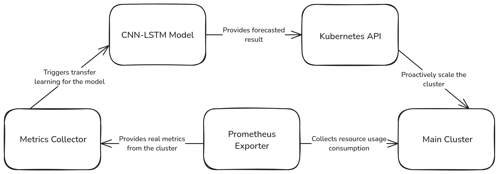
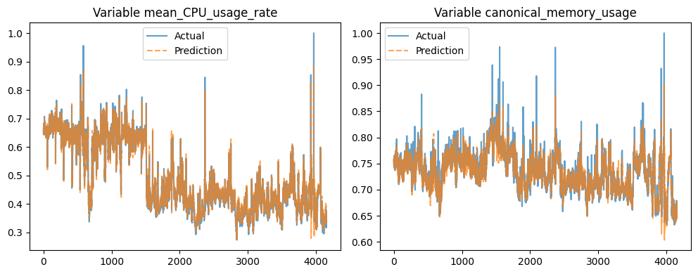

# **Predicting Kubernetes Resource Usage using Continuously Synced CNN-LSTM-TL**

## 📌 Overview
This repository implements a hybrid deep learning architecture combining Convolutional Neural Networks (CNN), Long Short-Term Memory (LSTM), and Transfer Learning (TL) to predict Kubernetes resource utilization. The "continuously synced" aspect refers to our real-time data pipeline that maintains up-to-date predictions through periodic model retraining.

## 🔍 Problem Statement
- **Challenge**: Over-provisioning leads to wasted resources while under-provisioning causes service degradation
- **Our Approach**:
  - Predict CPU/Memory utilization at container/pod level
  - Enable proactive resource allocation

## ⚙️ Technical Architecture
 

### 🧠 Model Components:
1. **CNN Layer**
   - Extracts spatial patterns from multi-dimensional resource metrics
   - Identifies correlated resource usage patterns across containers

2. **LSTM Layer**
   - Captures temporal dependencies in time-series data
   - Handles variable-length input sequences

3. **Transfer Learning (TL)**
   - Adapts pre-trained models to new Kubernetes clusters
   - Reduces cold-start time for new deployments

4. **Continuous Sync Mechanism**
   - Scheduled retraining every [X] hours
   - Online learning support for critical updates

## 📦 Data Preparation
### Source
- Google Cluster Trace Dataset V2 (container-level metrics)

## 🏋️‍♂️ Model Training
### Hyperparameters
| Parameter         | Value                 |
|------------------|------------------------|
| Batch Size        | 64                    |
| Learning Rate     | 0.0001                 |
| Sequence Length   | 10 timesteps / rows   |
| Hidden Units      | 128                   |

### Training Process:
TODO

### Evaluation Metrics
| Metric           | CPU                    | Memory                 |
|------------------|------------------------|-------------------------|
| **RMSE**         | `0.00966`              | `0.01196`               |
| **MAE**          | `0.00691`              | `0.00771`               |
| **MAPE**         | `0.01545` (1.54%)      | `0.01041` (1.04%)       |
| **R² Score**     | `0.99355`              | `0.90464`               |

---

#### Notes:
- **RMSE**: Root Mean Squared Error  
- **MAE**: Mean Absolute Error  
- **MAPE**: Mean Absolute Percentage Error (`value × 100%`)  
- **R² Score**: Coefficient of determination (closer to 1.0 = better fit)

## Python Dependencies
The python version used is version `3.12.8`. The dependecies are listed in [`requirements.txt`](requirements.txt). 

## 📁 Project Structure

- **datasets**: contains the preprocessed data from Google Cluster Trace Dataset V2.
- **models**: contains the state_dicts of the trained models.
- **notebooks**: contains the notebooks used for training the models.
- **scripts**: contains scripts used to preprocess the raw dataset.
- **web**: contains files necessary to run the prediction API.

## 🌐 API Service
### Endpoints
Endpoints are documented using Swagger in [`<your_ip>:<your_port>/docs]

### Running Locally:
```bash
cd web/
pip install -r requirements.txt
uvicorn main:app --reload
```

## 🚀 Usage Guide
### 1. Setup
```bash
git clone https://github.com/KirantiLoh/kubeforecaster.git
cd kubeforecaster
pip install -r requirements.txt
```

### 2. Data Processing
```bash
python scripts/prepare_dataset.py
```

### 3. Train Model
```bash
python notebooks/train_cnn_lstm_tl.py \
  --epochs 50 \
  --batch_size 64
```

### 4. Start API
```bash
cd web/
python -m uvicorn main:app --host 0.0.0.0 --port 8000
```

## 📊 Results Visualization
### Training curves

### Prediction comparison
- #### Prediction comparison in processed Google Cluster Trace Dataset V2
    

## ⚙️ Configuration
All configuration parameters are in `config.yaml`:
```yaml
model:
  dropout_rate: 0.3
sync:
  interval_hours: 6
```

<!-- ## 🤝 Contributing
Please read [CONTRIBUTING.md](CONTRIBUTING.md) for details on code submission guidelines. -->

<!-- ## 📄 License
This project uses the MIT License - see [LICENSE](LICENSE) for details. -->

## 📬 Contact
Maintainer: Maurice Yang <mauriceyangmy28@gmail.com@gmail.com>
